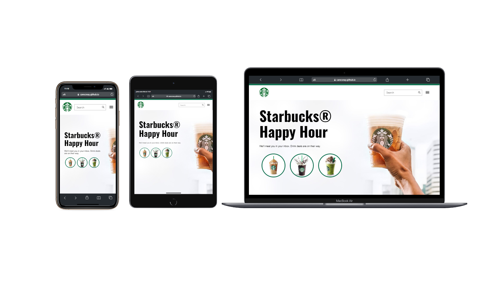

<h1 align="center">Starbucks</h1>

  <a href="#-Deployment">Deployment</a>&nbsp;&nbsp;&nbsp;|&nbsp;&nbsp;&nbsp;
  <a href="#-Tecnologias">Tecnologias</a>&nbsp;&nbsp;&nbsp;|&nbsp;&nbsp;&nbsp;
  <a href="#-Projeto">Projeto</a>&nbsp;&nbsp;&nbsp;|&nbsp;&nbsp;&nbsp;
  <a href="#-Layout">Layout</a>&nbsp;&nbsp;&nbsp;&nbsp;&nbsp;&nbsp;

## 🔖 Deployment

Você pode visualizar o deploy do projeto através desse link:
 🟢[GitHub Pages](https://carecsnay.github.io/Starbucks/) 

  <h3 align="center">Preview</h3>
  

## 🚀 Tecnologias

Esse projeto foi desenvolvido com as seguintes tecnologias:

- HTML5 
- CSS3
- JS

## 💻 Projeto

O projeto é uma iniciativa que visa replicar a aparência do site oficial da [Starbucks](https://nicepage.com/html-templates/preview/starbucks-coffee-17223?device=desktop), garantindo que o site clone seja adaptável a diferentes dispositivos por meio da aplicação de técnicas de responsividade. Dessa forma, os usuários podem desfrutar de uma experiência similar à do site original, independentemente do dispositivo que estiverem utilizando.

## 🔖 Layout

 
  

---

Todos os direitos reservados [Nicepage](https://nicepage.com/).

